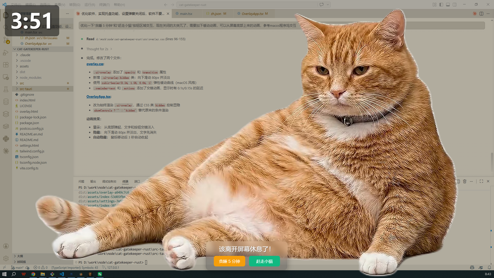
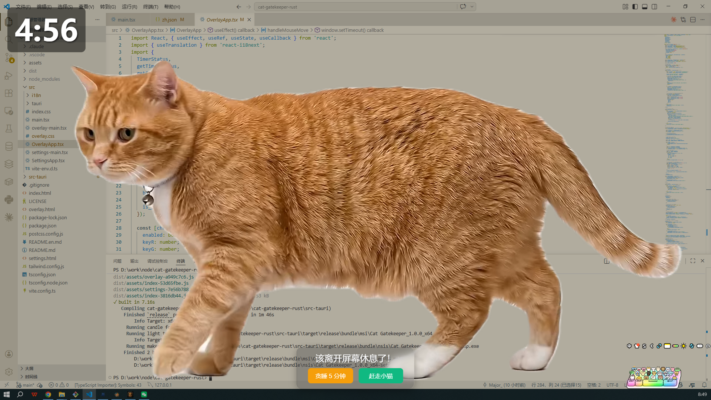

# 猫咪看门人 (Cat Gatekeeper)

> 一个基于 Tauri 的桌面应用，通过可爱的猫咪视频提醒您定期休息屏幕。这个项目是对原 Electron 应用的重构版本，采用 Rust 后端和 React 前端。

当您的工作时间结束时，一只可爱的猫咪会从屏幕一侧滑入，然后躺下睡觉——这只可爱的猫咪守卫将强制执行 HSE 推荐的屏幕休息时间。

**这个项目欢迎贡献！** 无论您想要修复错误、添加功能、改进文档，还是分享您最喜欢的猫咪视频——所有贡献都欢迎。请参阅下方的 [贡献指南](#贡献指南)。

## ✨ 功能特性

- **猫咪覆盖层** — 带有动画猫咪的趣味全屏休息提醒
- **双视频生命周期** — 活跃的猫咪滑入，然后过渡到睡觉的猫咪
- **符合 HSE 标准** — 默认 50 分钟工作 / 5 分钟休息间隔
- **可自定义** — 根据您的喜好调整工作/休息间隔
- **系统托盘** — 在后台安静运行，带有暂停/恢复控制
- **多显示器支持** — 在所有显示器上工作
- **自定义视频** — 使用您自己的猫咪视频（开发中）
- **贪睡功能** — 当您专注时增加 5 分钟

## 📸 效果预览

### 活跃猫咪动画


### 睡觉猫咪动画


## 🚀 快速开始

```bash
# 安装依赖
npm install

# 启动开发模式
npm run tauri:dev
```

应用将在您的系统托盘启动。猫咪将在 50 分钟（默认）后出现，休息 5 分钟。

> 应用程序默认包含真实的猫咪视频（`neko1.webm`, `neko2.webm`）和 `assets/` 目录中的所有必需资源。无需额外设置。

## 📥 安装

### 从 Releases 下载

对于大多数用户，我们建议下载最新版本：

1. 访问 [Releases 页面](https://github.com/Major9506/cat-gatekeeper/releases)
2. 下载适用于您平台的安装程序：
   - **Windows**: `.exe` 安装程序
   - **macOS**: `.dmg` 镜像文件
   - **Linux**: `.AppImage` 文件

## 🛠️ 命令

| 命令 | 描述 |
|------|------|
| `npm start` | 启动开发服务器 |
| `npm run dev` | 启动开发服务器（带热重载） |
| `npm run build` | 构建前端应用 |
| `npm run tauri:dev` | 启动 Tauri 开发模式 |
| `npm run tauri:build` | 构建 Tauri 应用程序 |
| `npm run preview` | 预览构建结果 |

## 🎮 工作原理

1. 应用程序在系统托盘中运行，带有后台计时器
2. 当工作时间结束时，打开全屏覆盖层
3. 活跃的猫咪视频播放 **一次**，从屏幕右侧滑入
4. 当活跃视频结束时，猫咪过渡到 **睡觉** 循环，同时显示剩余休息时间的大倒计时器
5. 提醒文本和控制出现在屏幕底部
6. 休息结束后，覆盖层关闭，计时器重置
7. 您可以贪睡（+5 分钟）或提前结束休息

## 🌍 语言切换

应用支持中文和英文两种语言，您可以根据需要切换：

### 通过设置界面
1. 右键单击托盘图标并打开 **设置**
2. 找到 **语言** 选项
3. 选择 **中文** 或 **英文**
4. 点击 **保存设置**

语言设置会立即生效，界面文本将更新为您选择的语言。

## 🎨 自定义猫咪视频 🚧

### 通过设置界面
1. 右键单击托盘图标并打开 **设置**
2. 滚动到 **自定义猫咪视频** 并点击 **浏览...**
3. 选择您的 MP4/WEBM/AVI/MOV 文件
4. 点击 **保存设置**

> **注意：** 此功能目前正在开发中。基本的视频选择功能已实现，但高级功能可能有限。

### 通过替换默认文件
活跃的猫咪视频默认为 `src/assets/neko1.webm`。您可以用自己的文件替换它（保持相同的名称），或使用设置界面选择任何视频文件。睡觉的猫咪（`neko2.webm`）始终与应用程序捆绑在一起。

### 视频指南
- **最佳：** 暗色或黑色背景的视频（与覆盖层融合）
- **良好：** 猫咪面部特写，没有分散注意力的背景
- **避免：** 绿屏视频 —— 色度键移除功能正在开发中
- **活跃猫咪格式：** WEBM 或 MP4（理想情况下简短，5-15 秒，播放一次）
- **建议：** 活跃视频使用走路的猫咪，睡觉视频使用休息的猫咪

### 使用 ffmpeg 处理绿屏视频为暗背景：

```bash
ffmpeg -i your_greenscreen.mp4 -vf "colorkey=0x00FF00:0.3:0.1,format=yuv420p" \
  -c:v libx264 -pix_fmt yuv420p src/assets/cat_processed.mp4
```

## 💻 技术栈

- **Tauri** — 跨平台桌面框架，使用 Rust 后端
- **React** — 前端用户界面库
- **TypeScript** — 类型安全的 JavaScript
- **Vite** — 快速的构建工具
- **i18next** — 国际化支持
- **Tailwind CSS** — 实用优先的 CSS 框架

## 🌍 语言切换

应用支持中文和英文两种语言，您可以根据需要切换：

### 通过设置界面
1. 右键单击托盘图标并打开 **设置**
2. 找到 **语言** 选项
3. 选择 **中文** 或 **英文**
4. 点击 **保存设置**

语言设置会立即生效，界面文本将更新为您选择的语言。

## 📚 文档语言切换

本文档提供两种语言版本：
- **中文**：[README.md](README.md)（本文件）
- **English**：[README.en.md](README.en.md)

您可以通过以下方式切换文档语言：
1. 打开 `README.md` 查看中文文档
2. 打开 `README.en.md` 查看英文文档
3. 使用语言切换脚本：`node README.switch.js <语言>`

### 使用语言切换脚本
```bash
# 切换到中文
node README.switch.js zh

# 切换到英文
node README.switch.js en

# 查看当前语言状态
node README.switch.js
```

## 📁 项目结构

```
cat-gatekeeper/
├── src/                    # React 前端
│   ├── components/         # React 组件
│   │   ├── BreakOverlay.tsx    # 休息覆盖层
│   │   ├── SettingsPanel.tsx   # 设置面板
│   │   └── TrayApp.tsx         # 系统托盘组件
│   ├── i18n/              # 国际化文件
│   │   ├── index.ts            # i18n 初始化
│   │   └── locales/            # 翻译文件
│   │       ├── zh.json         # 中文翻译
│   │       └── en.json         # 英文翻译
│   ├── tauri/             # Tauri API 集成
│   ├── App.tsx            # 主应用组件
│   ├── main.tsx           # 应用入口
│   └── index.css          # 全局样式
├── src-tauri/             # Tauri 后端
│   ├── src/
│   │   ├── main.rs           # 主 Rust 代码
│   │   └── lib.rs            # Rust 库
│   ├── Cargo.toml         # Rust 依赖
│   └── tauri.conf.json    # Tauri 配置
├── assets/                # 静态资源
│   ├── neko1.webm        # 活跃猫咪视频
│   ├── neko2.webm        # 睡觉猫咪视频
│   └── icon.png          # 应用图标
├── package.json           # Node.js 依赖
├── vite.config.ts        # Vite 配置
├── tailwind.config.js    # Tailwind CSS 配置
├── tsconfig.json         # TypeScript 配置
├── README.md              # 中文文档
├── README.en.md           # 英文文档
└── README.switch.js       # 语言切换脚本
```

## ⚙️ 默认设置

| 设置 | 默认值 | 范围 |
|------|--------|------|
| 工作间隔 | 50 分钟 | 5-120 分钟 |
| 休息时长 | 5 分钟（300 秒） | 1-10 分钟（60-600 秒） |
| 贪睡时长 | 5 分钟（300 秒） | 可配置 |
| 提示音 | 禁用 | 开/关 |
| 多显示器 | 启用 | 开/关 |
| 猫咪视频 | 绑定的 neko1.webm（活跃） + neko2.webm（睡觉） | 用户可选 |

## 📦 构建分发版本

### Windows
```bash
npm run tauri:build -- --target x86_64-pc-windows-msvc
```
在 `src-tauri/target/release/bundle/msi/` 中生成 NSIS 安装程序。

### macOS
```bash
npm run tauri:build -- --target x86_64-apple-darwin
```
在 `src-tauri/target/release/bundle/dmg/` 中生成 DMG。

### Linux
```bash
npm run tauri:build -- --target x86_64-unknown-linux-gnu
```
在 `src-tauri/target/release/bundle/appimage/` 中生成 AppImage。

## 🧪 开发模式

用于快速测试：

```bash
npm run tauri:dev
```

这将在开发模式下启动应用。

## 🤝 贡献

我们欢迎所有贡献！无论您是修复错误、添加功能、改进文档，还是分享猫咪视频——每一个贡献都很重要。

### 如何贡献

- 🐛 **报告错误** — 发现了什么问题？[打开 issue](https://github.com/Major9506/cat-gatekeeper/issues)
- 💡 **建议功能** — 有想法？我们很乐意听取
- 📝 **改进文档** — 更好的文档帮助每个人
- 🎨 **设计** — UI/UX 改进、图标、动画
- 🐱 **猫咪视频** — 分享您的猫咪视频用于覆盖层
- 💻 **代码** — 修复错误、构建功能、优化性能

### 开始使用

1. **Fork** 这个仓库
2. **创建您的功能分支**：`git checkout -b feature/amazing-feature`
3. **进行更改**
4. **彻底测试** — 使用 `npm run tauri:dev` 进行快速测试
5. **提交您的更改**：`git commit -m 'Add amazing feature'`
6. **推送到分支**：`git push origin feature/amazing-feature`
7. **打开 Pull Request**

### 开发指南

- 遵循现有的代码风格
- 为复杂的逻辑添加注释
- 尽可能在多个平台上测试（Windows、macOS、Linux）
- 添加功能时更新文档
- 保持 Pull Request 专注 — 每个 PR 一个功能/修复

## 📄 许可证

本项目采用 MIT 许可证 — 详情请参阅 [LICENSE](LICENSE) 文件。

## 🙏 致谢

- **[ぞくぞく](https://x.com/konekone2026)** — 原版 [Cat Gatekeeper Chrome 扩展](https://chromewebstore.google.com/detail/cat-gatekeeper/elbikiflgfhjdjmficnigpeegjbhdidh) 的创造者，旨在限制社交媒体使用。这个 Tauri 桌面应用程序受到他们 brilliant idea 的启发，调整为遵循 HSE 的屏幕休息指南。
- HSE（健康与安全执行机构）的屏幕休息建议
- 所有启发了这个项目的猫咪们 🐱

## 📬 联系与支持

- 🐛 **错误报告**：[GitHub Issues](https://github.com/Major9506/cat-gatekeeper/issues)
- 💬 **问题**：[Discussions](https://github.com/Major9506/cat-gatekeeper/discussions)

---

**用 ❤️ 为猫咪和健康的屏幕习惯制作**